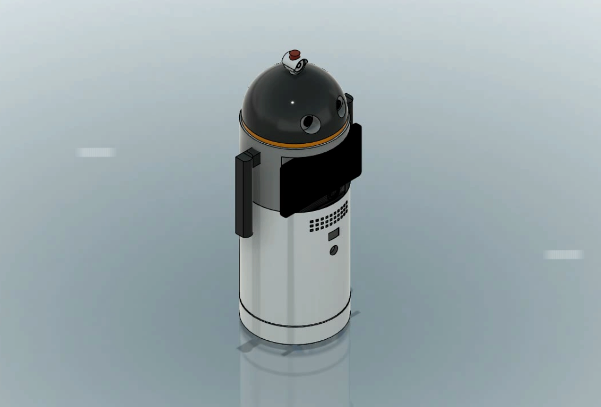
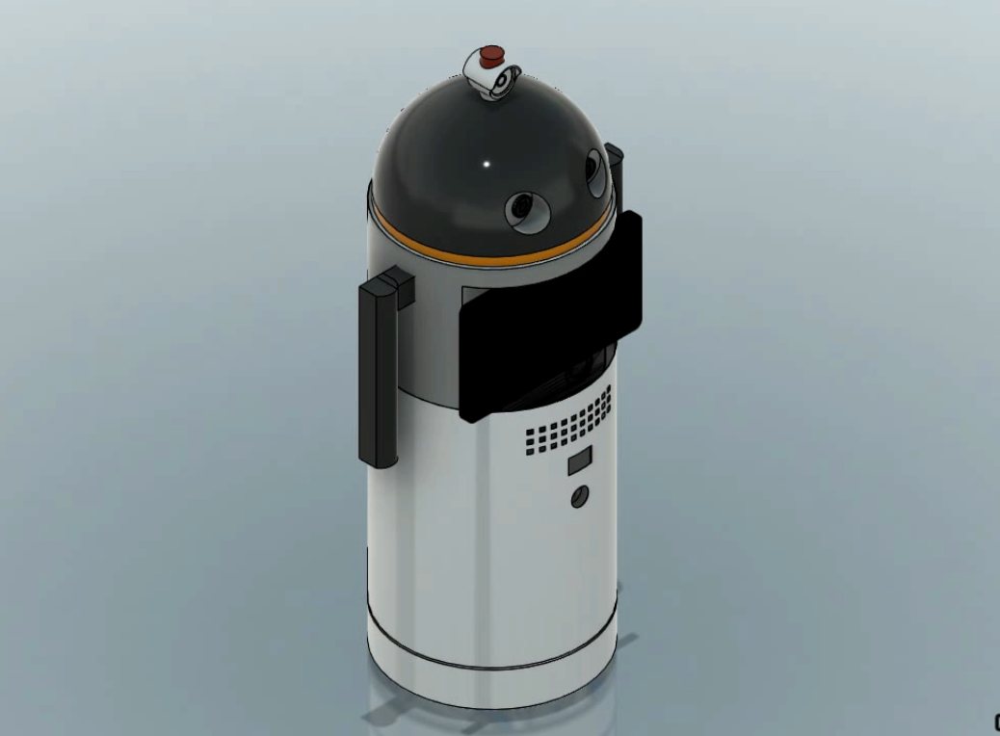
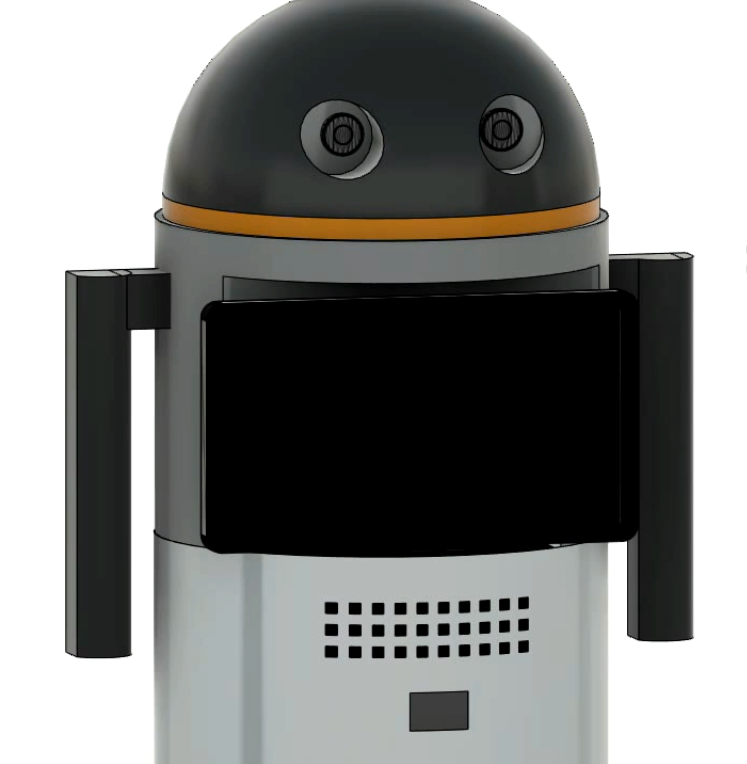
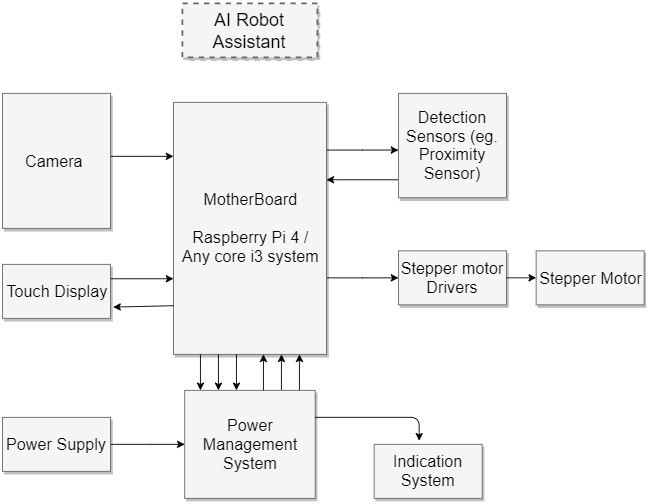
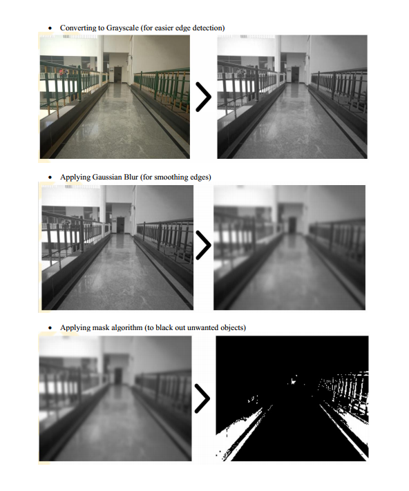
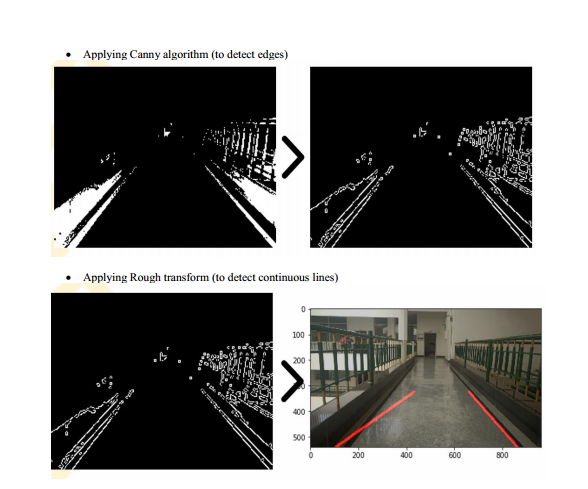
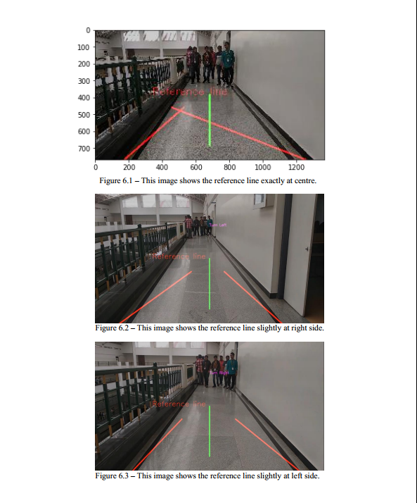

# AI_robot_interactive_webpage

Robot assistant with AI self mobility

https://drive.google.com/drive/folders/1XuCpKKvR3bpvKdb7dmlJDeRExVCBcfhn?usp=sharing

This project was mainly taken to reduce human work on silly tasks and promote automation, the robot is wholly based on vision, unlike other automatic moving robots, it uses its main camera for movement, obstacle detection and corner detection. This is possible by analyzing the camera data that is pixel data where Tensorflow comes under picture and for the path detection, the lanes are identified using the image library of python that is OpenCV.  The obtained simulation values and output are mentioned in the Product URL and the project is still ongoing.

Drive links redirect to videos and presentation files.

•	To design intelligent Robot Mobility.

•	To implement Artificial Intelligence and Machine Learning algorithm.

•	To implement sensors and smart vision system for human interaction.

•	To record student data via dedicated camera. 

Building the Algorithm

Steps followed to detect lanes and mark them are-

•	Importing image

•	Applying colour filters (to convert RGB to HSV)

•	Converting to Grayscale (for easier edge detection)

•	Applying Gaussian Blur (for smoothing edges)

•	Applying mask algorithm (to black out unwanted objects)

•	Applying Canny algorithm (to detect edges)

•	Restricting vision strictly to lanes

•	Applying Rough transform (to detect continuous lines)

•	Importing image-
  Getting video frames one by one.

•	Applying colour filters (to convert RGB to HSV)-
OpenCV works on HSV colour standards.

Intelligent Steering

Steering is completely based on distance between the lanes. After the robot recognizes lanes, a centre line is drawn exactly in middle referencing the width of the image (green line), a python script is then written where distance is pre-loaded, whenever the centre line is closer than usual, the script throws ‘Turn left’ and ‘Turn right’. Below are the steps:

•	STEP 1: Calculate distance between left lane and right lane with respect to centre lane.

•	STEP 2: Check whether the conditions satisfy of being centre.

•	STEP 3: Indicate Left if the centre line tilts to right and indicate right if the centre line tilts to left.
        These indications are given as pulse to stepper motor driver.

Components

•	Raspberry Pi 4/ Any core i3 system
•	Touch display
•	Camera
•	Detection sensors
•	Stepper drivers
•	Stepper motors
•	Mecanum wheels

Limitations

•	Interference in visibility stops mobility.
•	Operating on multiple floors.
•	Mobility is not possible without lanes.

Future work for next Semester

Till date the Robot knows- What are lanes, Recognize the lanes and Intelligently steer along the lanes, but still the physical model is required and an user UI is required, according to the requirements; a steel model will be built as per proposed design and an Android based application will be developed as the input is touch display and for mobility stepper motor drivers are connected to motherboard.

